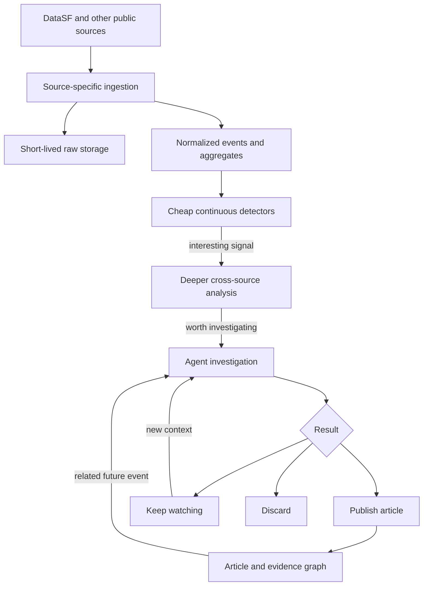

# Architecture

This document captures the current working plan. It should change as the project encounters real data.

## Product

Public Patterns is an automated investigative publication for San Francisco.

It watches public data for statistically unusual changes, investigates possible connections, and publishes concise findings with traceable evidence. A finding can remain unexplained, accumulate context over time, or be revised when later events provide a better explanation.

The initial product surface should remain simple:

- one feed with search and lightweight filters
- permanent, directly addressable article URLs
- full article views with citations and visualizations
- related investigations and a path to the next article

## System flow



Analysis should become more expensive only as a signal becomes more interesting:

1. Maintain counts, rates, rolling baselines, and geographic buckets.
2. Detect bursts, persistent recurrence, or meaningful deviations.
3. Search nearby time periods, locations, entities, datasets, and prior investigations.
4. Ask an agent to investigate candidates that survive cheap validation.
5. Publish, monitor, or discard the result.

## Initial Cloudflare stack

- **Workers and Cron Triggers** poll sources and expose the application API.
- **Queues** fan ingestion and analysis work out safely.
- **D1** stores cursors, aggregates, cases, articles, evidence, and links.
- **R2** retains raw batches from rolling feeds and reproducible evidence snapshots.
- **Vectorize** supports semantic article discovery if ordinary search becomes insufficient.
- **Workflows** coordinates durable, multi-step investigations.
- **Pages or Workers Assets** serves the React application.
- **PostHog** measures how people search, navigate, and understand the publication.

The initial application should stay entirely on Cloudflare so it can scale to zero and remain cheap when development pauses.

## Source ingestion

Sources should share a pipeline without pretending they share a schema. Each adapter will eventually define some version of:

```ts
type SourceAdapter = {
  schedule: string
  fetchChanges: (cursor?: string) => Promise<unknown[]>
  primaryKey: (record: unknown) => string
  normalize: (record: unknown) => NormalizedEvent
  nextCursor: (records: unknown[]) => string | undefined
  retention: "aggregate" | "lightweight" | "raw"
}
```

Most historical data can remain in DataSF and be queried during an investigation. Rolling feeds require deeper retention: the real-time police dispatch dataset, for example, exposes only a rolling 48-hour window.

High-level aggregates should live indefinitely. Raw source data should expire unless it is needed to reconstruct a rolling feed or support published evidence.

## Geography and correlation

The MVP can represent geography with H3 cells stored in D1. This supports cheap comparisons across the same or neighboring areas without requiring PostGIS.

Cross-source correlation should not run exhaustively across every record. A detector first produces a candidate; deeper analysis then searches:

- adjacent time buckets
- the same and neighboring H3 cells
- shared addresses, parcels, businesses, departments, or other entities
- semantically or structurally similar investigations

Correlation is evidence, not causation. Published language must preserve that distinction.

## Investigations, articles, and links

An internal **case** contains the signal, evidence, hypotheses, agent activity, status, and related cases.

An **article** is the concise public projection of a case. It has a permanent URL, revision history, metadata, citations, and evidence-backed visualizations.

Article relationships can begin as a simple edge table:

```sql
CREATE TABLE article_links (
  from_article_id TEXT NOT NULL,
  to_article_id TEXT NOT NULL,
  rationale TEXT,
  PRIMARY KEY (from_article_id, to_article_id)
);
```

Agents should receive linked article titles, summaries, slugs, and rationales when reading an article. This makes traversal feel like following links between documents while preserving database queryability. Edge types can be added only if real use demonstrates a need.

## Article format

The current direction is restricted MDX: ordinary Markdown plus a small registry of evidence components.

```mdx
Reports increased 280% over the seasonal baseline.

<Trend query="311-noise-mission-30d" />
<Map query="related-events-abc123" />
<Source dataset="vw6y-z8j6" record="..." />
```

Generated articles may reference registered components and saved queries but may not import or execute arbitrary code. Validation rejects anything outside the supported document grammar.

Evidence queries can be:

- **live**, when the visualization should follow an evolving situation
- **snapshotted**, when the article must preserve the exact result supporting its prose

Each article should eventually be available as a rendered page, agent-readable Markdown, and structured JSON.

## Agent and tool layer

The investigator should use a reusable, read-oriented tool surface:

- search and read articles
- query source datasets
- inspect trends and nearby events
- traverse related cases
- search and read the web
- create evidence blocks
- revise or classify a case

The same capabilities should be exposed through MCP for internal investigators and external agents.

The agent harness remains undecided. Initial experiments should compare:

1. a Cloudflare-native agent using Agents, Code Mode, and Workflows
2. Pi running inside an ephemeral Cloudflare Sandbox

A sandbox is an escalation tier, not a requirement for every investigation. It becomes useful when an agent needs Python, custom statistical analysis, or a filesystem-backed research session.

## Initial sources and detectors

Likely first sources:

- law-enforcement dispatch
- 311 cases
- temporary street closures
- weather

Likely first detectors:

- spatiotemporal bursts
- persistent recurrence
- deviations from hour/day/seasonal baselines
- cross-source overlap around an already-interesting signal

## Open decisions

- the exact frontend framework and visual language
- the first source adapter and canonical event shape
- D1 schema and retention periods
- H3 resolution and baseline windows
- article component grammar
- agent harness and model
- editorial thresholds for publishing
- when investigations may publish without human review
