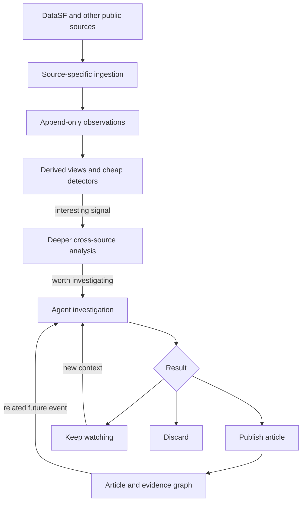
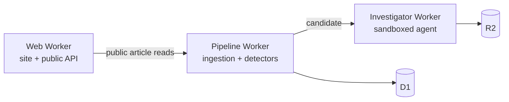
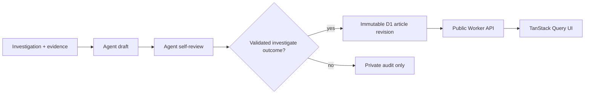

# Architecture

This document captures the current working plan. It should change as the project encounters real data.

## Product

Public Patterns is an automated investigative publication for San Francisco.

It watches public data for statistically unusual changes, investigates possible connections, and publishes concise findings with traceable evidence. A finding can remain unexplained, accumulate context over time, or be revised when later events provide a better explanation.

The initial product surface should remain simple:

- one feed with search and lightweight filters
- permanent, directly addressable article URLs
- full article views with citations and visualizations
- related investigations and a path to the next article

## System flow



Analysis should become more expensive only as a signal becomes more interesting:

1. Maintain counts, rates, rolling baselines, and geographic buckets.
2. Detect bursts, persistent recurrence, or meaningful deviations.
3. Search nearby time periods, locations, entities, datasets, and prior investigations.
4. Ask an agent to investigate candidates that survive cheap validation.
5. Publish, monitor, or discard the result.

## Infrastructure

The current stack is deliberately small:

- **Workers Assets** serves the React application.
- **A pipeline Worker** ingests sources and runs cheap detectors.
- **D1** stores observations, source errors, and ingestion cursors.
- **An investigator Worker** runs one sandboxed agent per selected candidate.
- **R2** stores investigation audit bundles for review and replay.

Add infrastructure only when a concrete need appears:

- a Cron Trigger when ingestion is deployed
- a Queue when one request can no longer finish bounded work safely
- Workflows when an investigation becomes a durable multi-step operation
- PostHog when there is a real product surface to measure
- Vectorize only if ordinary metadata and full-text search prove insufficient

Cloudflare remains the default host, not a requirement that every Cloudflare
service appear in the design.

## Worker boundaries

The repository is a pnpm workspace with three applications:



Production CI applies D1 migrations before deploying the investigator,
pipeline, and web Workers. Private service bindings connect web to pipeline and
pipeline to investigator. Only the web Worker has a public route.

Within each application, organize code by product feature and keep runtime
entrypoints thin. Shared packages should appear only after two applications
need the same proven logic.

## Source ingestion

Sources share an observation shape without pretending their APIs share cursor
behavior. Configured DataSF sources share one bounded keyset reader while 511
owns its snapshot state. Each physical source emits append-only observations
with a common identity, event time, update time, category, area, and flexible
`data` JSON.

Most historical raw data can remain in DataSF and be queried during an
investigation. Rolling feeds require deeper retention: the real-time police
dispatch dataset, for example, exposes only a rolling 48-hour window.

Every distinct publisher version we observe remains available. Exact replay is
collapsed by physical source, ID, update time, and a storage-only content hash,
while consumers decide whether to read history or select the current version.
Realtime and closed dispatch feeds are separate ingestion targets and cursor
names. Dispatch read logic combines them and prefers a closed call when both
contain the same ID; that source-specific rule is not part of ingestion or the
generic observation shape. This keeps correction history available without
encoding invalidation, reactivation, projection versions, or detector lifecycle
into storage.

The generic columns support indexing and cheap detection. Source-specific JSON
stays in `data` for later investigation. Partitioning, retention tiers, and
immutable evidence snapshots should be added only when measured volume or a
published claim requires them.

## Geography and correlation

The first detectors use publisher-provided area labels. Add derived H3 cells
only when a real detector needs stable neighboring-area queries; the source
coordinates remain available in `data`.

Cross-source correlation should not run exhaustively across every record. A detector first produces a candidate; deeper analysis then searches:

- adjacent time buckets
- the same and neighboring H3 cells
- shared addresses, parcels, businesses, departments, or other entities
- semantically or structurally similar investigations

Correlation is evidence, not causation. Published language must preserve that distinction.

## Investigations, articles, and links

An internal **case** contains the signal, evidence, hypotheses, agent activity, status, and related cases.

An **article** is the concise public projection of a case. It has a permanent URL, revision history, metadata, citations, and evidence-backed visualizations.

Article relationships can begin as a simple edge table:

```sql
CREATE TABLE article_links (
  from_article_id TEXT NOT NULL,
  to_article_id TEXT NOT NULL,
  rationale TEXT,
  PRIMARY KEY (from_article_id, to_article_id)
);
```

Agents should receive linked article titles, summaries, slugs, and rationales when reading an article. This makes traversal feel like following links between documents while preserving database queryability. Edge types can be added only if real use demonstrates a need.

## Article format and publication

An investigation may return a structured article draft: Markdown body, explicit
sources, and at most one validated timeline, comparison, or source-trace
figure. It cannot execute arbitrary code. Before submission, the agent writes a
claim-by-claim review and revises the draft; both are retained in the R2 audit
bundle.

After review, the agent generates one understated, place-based hero. Every
public article revision requires a stored hero; a failed image attempt leaves a
valid private investigation but blocks publication until a later attempt
succeeds. The image is contextual presentation rather than evidence: it must
not reconstruct an incident or imply that pictured people or properties appear
in the records. The sandbox receives a fixed low-cost OpenAI image tool, while
the investigator Worker validates and moves the resulting WebP into R2. The
public Worker serves only the article-media prefix; investigation archives
remain private.

Publication is a separate, explicit operation:



The public article is a projection of the reviewed investigation, not a
separate hand-written fixture. D1 stores searchable article documents and
revision metadata; R2 retains the larger investigation session and evidence
archive. Article list responses omit the body and figure to keep feed reads
small. A permanent slug identifies the article while immutable revisions leave
room for later corrections without losing prior text.

Saved, reproducible figure data is the default. Live evidence queries remain a
future option for situations where a visualization must track an evolving
event.

During the initial unattended trial, a valid `investigate` result publishes
automatically with an agent-assigned editorial significance score. An
authenticated internal delete operation can remove a bad article from the
public feed without deleting its D1 investigation or R2 audit archive.

## Agent and tool layer

The investigator should use a reusable, read-oriented tool surface:

- search and read articles
- query source datasets
- inspect trends and nearby events
- traverse related cases
- search and read the web
- create evidence blocks
- revise or classify a case

The same capabilities should be exposed through MCP for internal investigators and external agents.

The first agent experiment uses OpenCode 2 with DeepSeek V4 Pro Thinking inside
one ephemeral Cloudflare Sandbox per investigation. The candidate arrives as
flexible JSON on disk; the agent can use Python, web research, and baked-in
analysis skills, then signals completion through a typed `submit_brief` tool.
The Worker accepts the submitted brief, structured article draft, and review;
archives the input, redacted session output, and result in R2; then destroys the
sandbox. D1 keeps the searchable investigation record and its R2 object key.
Compact eval definitions
stay in git; bulky source snapshots and replay evidence belong in R2.

An investigation does not need to uncover a mystery. It may advance when
meaningfully distinct sources add enough context, consequences, comparison, or
corroboration for a mildly interesting evidence-backed account, even if the
event is already understood. A second dataset that only repeats an originating
call does not qualify. The eventual article may be one paragraph with linked
sources or a useful visualization; richer presentation is optional.

The investigator is a separate Worker because Containers, model spend, and
failure isolation differ materially from ingestion. The private workbench is
available for manual runs. During the initial tuning trial, one morning job
selects one previously uninvestigated burst and publishes a valid
`investigate` article. `watch`, `discard`, and failed publication outcomes stay
private for audit. The current prototype passes a limited DeepSeek key into
each ephemeral sandbox; move that credential behind a short-lived proxy before
this automatic trial expands or investigations accept untrusted inputs.
Workflows, persistent sessions, and MCP remain deferred until an investigation
demonstrates the need.

External API gateways classify authentication, exhausted credits, rate limits,
timeouts, provider outages, and network failures without logging credentials.
Structured diagnostics include the provider request ID and a concrete operator
action. Blocking model failures and image failures remain in the private
investigation archive for later audits. Image failures do not change the
investigation outcome, but their drafts cannot be promoted publicly.

## Initial sources and detectors

Active MVP slices:

- law-enforcement dispatch
- 311 cases
- Fire/EMS dispatched responses
- police incident reports
- building complaints and permits
- injury crashes
- health inspections
- eviction notices
- 511 SFMTA transit alerts

Context-source candidates remain temporary street closures and weather.

Working dataset IDs, schemas, volume measurements, and ingestion caveats live
in [`docs/sources/`](./docs/sources/). Read the relevant dossier before turning
one of these candidates into an adapter contract.

The experimental detector reads the derived current observation view and
compares `kind` plus `area` against the previous four matching weekdays. It
runs only after the pipeline has collected the baseline window. Results are
derived on request rather than persisted as workflow state, and its thresholds
remain provisional rather than statistical claims.

A recent-observation cluster detector is a useful next experiment because it
could activate without historical coverage. Its result would need only
observation IDs and cluster metrics; later analysis can load the observations.
That experiment does not require a stored cluster model or candidate lifecycle.

Possible later detectors:

- spatiotemporal bursts
- persistent recurrence
- deviations from hour/day/seasonal baselines
- cross-source overlap around an already-interesting signal

## Open decisions

- the exact frontend framework and visual language
- whether measured observation volume ever requires D1-to-R2 partitioning
- H3 resolution and baseline windows
- article component grammar
- editorial thresholds for publishing
- when investigations may publish without human review
