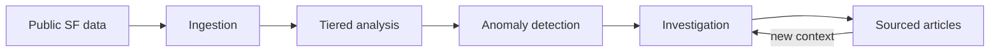

# Public Patterns

Public Patterns is me looking at [San Francisco's open data](https://data.sfgov.org/) and wondering what becomes visible when software continuously looks for unusual changes, connections, and possible explanations.

The idea is to ingest public city data, detect patterns worth investigating, and publish concise articles that show their evidence. Some findings may have likely explanations. Others may remain unexplained until new information connects back to them.

At a high level:



The project is SF-first and intentionally exploratory. The current architecture
and open questions live in [ARCHITECTURE.md](./ARCHITECTURE.md); dataset
research lives in [`docs/sources/`](./docs/sources/).

## Status

I had the idea after finding DataSF and started the repository a couple hours later. The first thing here is a small coming-soon page while I work out the first dataset and detector.

## Development

This is a pnpm workspace organized around independently deployable Cloudflare
Workers:

- `apps/web` — the site and public API
- `apps/pipeline` — future ingestion and anomaly detection
- `apps/investigator` — future agent investigations

Only `apps/web` is executable today.

```sh
pnpm install
pnpm dev
```

`pnpm dev` runs the React application and web Worker together in local
Workerd at `http://127.0.0.1:5173`. It selects the Cloudflare `dev`
environment, preserves local binding data under `apps/web/.wrangler/state`,
and does not contact or modify deployed Cloudflare resources.

```sh
pnpm dev:smoke
```

The smoke test starts an isolated local server, verifies the application shell
and Worker health endpoint, and confirms the Worker reports the `dev`
environment. A separately named `public-patterns-web-dev` Worker can be
deployed only through the manual **Deploy dev** GitHub Actions workflow when
an edge-hosted test is necessary.

Node 22 or newer is required.

## License

[MIT](./LICENSE)
