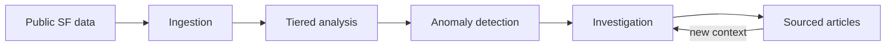

# Public Patterns

Public Patterns is me looking at [San Francisco's open data](https://data.sfgov.org/) and wondering what becomes visible when software continuously looks for unusual changes, connections, and possible explanations.

The idea is to ingest public city data, detect patterns worth investigating, and publish concise articles that show their evidence. Some findings may have likely explanations. Others may remain unexplained until new information connects back to them.

At a high level:

The project is SF-first and intentionally exploratory. The current architecture and open questions live in [ARCHITECTURE.md](./ARCHITECTURE.md).

## Status

I had the idea after finding DataSF and started the repository a couple hours later. There is nothing working yet.

## License

[MIT](./LICENSE)
