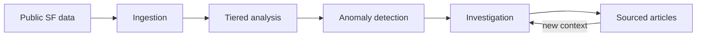

# Public Patterns

Public Patterns is me looking at [San Francisco's open data](https://data.sfgov.org/) and wondering what becomes visible when software continuously looks for unusual changes, connections, and possible explanations.

The idea is to ingest public city data, detect patterns worth investigating, and publish concise articles that show their evidence. Some findings may have likely explanations. Others may remain unexplained until new information connects back to them.

At a high level:



The project is SF-first and intentionally exploratory. The current architecture
and open questions live in [ARCHITECTURE.md](./ARCHITECTURE.md); dataset
research lives in [`docs/sources/`](./docs/sources/).

## Status

The repository has a small coming-soon site plus local ingestion for 311,
law-enforcement dispatch, Fire/EMS responses, police incidents, building
complaints and permits, injury crashes, health inspections, eviction notices,
and 511 transit alerts. The pipeline stores append-only observations in local
D1 and derives experimental signals on demand. A local investigator can analyze
one candidate inside an ephemeral sandbox. Neither Worker is deployed.

## Development

This is a pnpm workspace with three Cloudflare Worker applications:

- `apps/web` — the site and public API
- `apps/pipeline` — local ingestion, reconciliation, and anomaly detection
- `apps/investigator` — local sandboxed agent investigations

```sh
pnpm install
pnpm dev
```

`pnpm dev` runs the React application and web Worker together in local
Workerd at `http://127.0.0.1:5173`. It selects the Cloudflare `dev`
environment, preserves local binding data under `apps/web/.wrangler/state`,
and does not contact or modify deployed Cloudflare resources.

```sh
pnpm --filter @public-patterns/pipeline db:migrate:local
doppler run -- pnpm dev:pipeline
```

The pipeline runs separately at `http://127.0.0.1:8787` with local D1 state.
DataSF ingestion works without credentials at lower shared rate limits. The
511 transit source requires `TRANSIT_511_API_KEY` in the repo-scoped Doppler
`dev` config. Run `pnpm test` for unit tests and the isolated Worker+D1 smoke
test.

`pnpm dev:investigator:smoke` runs one historical case through the sandboxed
agent and prints its brief. It requires Docker and Doppler and makes a paid
DeepSeek request.

`pnpm dev:smoke` verifies the web application locally. A separately named
`public-patterns-web-dev` Worker can be deployed only through the manual
**Deploy dev** GitHub Actions workflow. CI deploys only the web Worker; the
pipeline and investigator have no remote deployment workflow.

Node 22 or newer is required.

## License

[MIT](./LICENSE)
